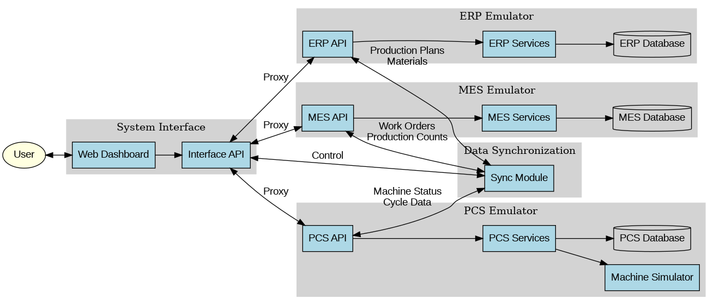

# Manufacturing Emulator System

A comprehensive manufacturing emulator system that simulates the interaction between ERP (Enterprise Resource Planning), MES (Manufacturing Execution System), and PCS (Process Control System) for testing manufacturing MVP solutions.

## Overview

This system provides a complete emulation environment for manufacturing operations with a focus on plastic injection molding. It includes:

- **ERP Emulator**: Handles master data, inventory, production planning, and order processing
- **MES Emulator**: Manages work orders, scheduling, quality control, and production tracking
- **PCS Emulator**: Simulates plastic injection machines with realistic cycle phases and sensor data
- **Data Synchronization**: Ensures time-synchronized data flow between all systems
- **Unified Interface**: Provides dashboards and controls for the integrated system

## System Architecture

The system is built with a modular architecture where each component (ERP, MES, PCS) operates independently but communicates through well-defined APIs. The data synchronization module ensures consistent data across all systems.



## Installation

### Prerequisites

- Python 3.10 or higher
- SQLite (included in Python)
- Modern web browser

### Setup

1. Clone the repository:
   ```
   git clone <repository-url>
   cd manufacturing_emulator
   ```

2. Create a virtual environment and install dependencies:
   ```
   python -m venv venv
   source venv/bin/activate  # On Windows: venv\Scripts\activate
   pip install -r requirements.txt
   ```

3. Initialize the database:
   ```
   python database/init_db.py
   ```

## Running the System

### Starting Individual Components

Each component can be started independently:

1. Start the ERP emulator:
   ```
   python erp/main.py
   ```

2. Start the MES emulator:
   ```
   python mes/main.py
   ```

3. Start the PCS emulator:
   ```
   python pcs/main.py
   ```

4. Start the unified interface:
   ```
   python common/interface.py
   ```

### Starting the Complete System

To start all components at once, use the system interface:

1. Start the interface:
   ```
   python common/interface.py
   ```

2. Open a web browser and navigate to:
   ```
   http://localhost:5000
   ```

3. Click the "Start System" button on the dashboard to start all components.

## System Components

### ERP Emulator

The ERP emulator provides the following functionality:

- Master data management (materials, products, BOMs)
- Inventory control
- Production planning
- Order processing
- API endpoints for integration with MES

Access the ERP dashboard at: `http://localhost:5001`

### MES Emulator

The MES emulator provides the following functionality:

- Work order management
- Production scheduling
- Quality control
- Material tracking
- Production counting
- Downtime tracking
- API endpoints for integration with ERP and PCS

Access the MES dashboard at: `http://localhost:5002`

### PCS Emulator

The PCS emulator provides the following functionality:

- Plastic injection machine simulation
- Machine parameter control
- Sensor data generation
- Cycle data collection
- Alarm handling
- API endpoints for integration with MES

Access the PCS dashboard at: `http://localhost:5003`

### Data Synchronization

The data synchronization module ensures that data is consistently updated across all systems:

- Production plans from ERP to MES
- Materials from ERP to MES
- Production counts from MES to ERP
- Material consumption from MES to ERP
- Work orders from MES to PCS
- Machine status from PCS to MES
- Production cycles from PCS to MES
- Quality data from PCS to MES

### Unified Interface

The unified interface provides a single dashboard for monitoring and controlling the entire system:

- System status overview
- Production monitoring
- Inventory status
- Machine status
- Quality overview
- System control (start/stop)

Access the unified interface at: `http://localhost:5000`

## API Documentation

Each component provides a RESTful API for integration:

- ERP API: `http://localhost:5001/api/v1`
- MES API: `http://localhost:5002/api/v1`
- PCS API: `http://localhost:5003/api/v1`
- Interface API: `http://localhost:5000/api`

Detailed API documentation is available in the [API Documentation](docs/api_documentation.md) file.

## Testing

The system includes comprehensive integration tests to ensure all components work together properly:

```
python tests/integration_test.py
```

## Configuration

System configuration is stored in `config.yaml`. You can modify this file to change ports, database connections, and other settings.

## Extending the System

The system is designed to be extensible. You can add new features or modify existing ones:

- Add new machine types to the PCS emulator
- Implement additional ERP or MES functionality
- Create custom dashboards for specific use cases
- Add new data synchronization paths

See the [Developer Guide](docs/developer_guide.md) for more information.

## Troubleshooting

If you encounter issues:

1. Check the log files in each component directory
2. Verify that all components are running
3. Ensure the database was properly initialized
4. Check the configuration in `config.yaml`

For more detailed troubleshooting, see the [Troubleshooting Guide](docs/troubleshooting.md).

## License

This project is licensed under the MIT License - see the [LICENSE](LICENSE) file for details.
# manufacturing_emulator
